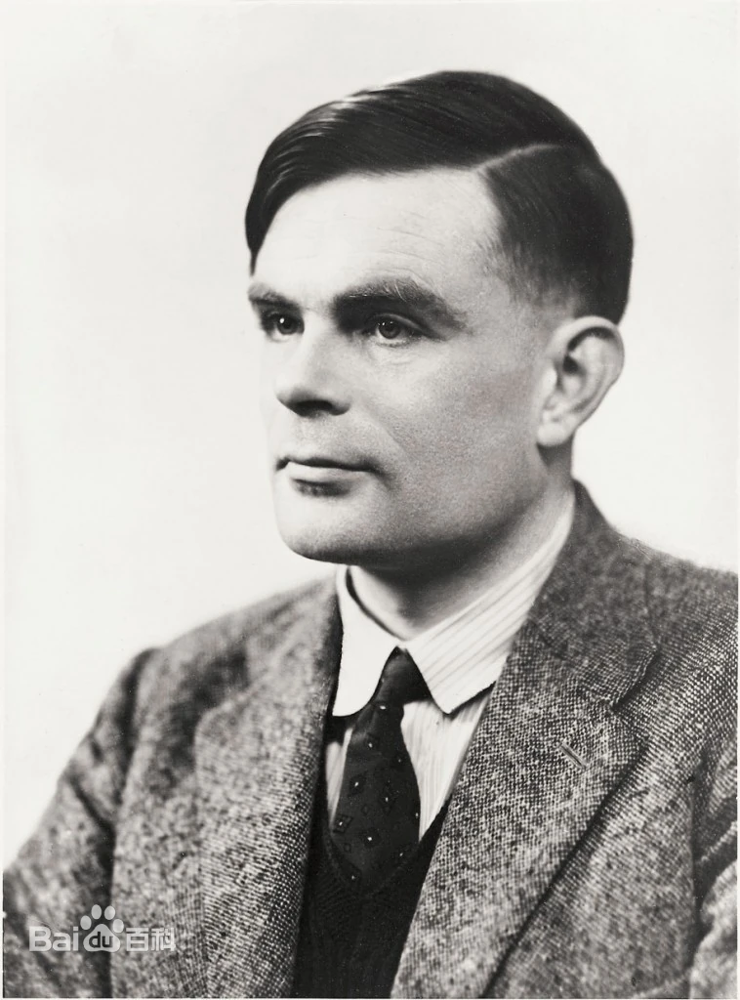

# 艾伦·麦席森·图灵 

## 个人信息 

  

   
- 性别：男
- 国籍：英国
- 毕业院校：普林斯顿大学
- 职业：教学科研工作者
- 主要成就
    - 1936年提出**图灵机模型**
    - 1950年提出**图灵测试**
    - 1951年当选为**英国皇家学会院士**
- 代表作品
    - 《论可计算的数及其在密码问题中的应用》
    - 《计算机器与智能》

  
## 科技成就
- **图灵机**   
  1936年，图灵发表了一篇论文《论可计算的数及其在密码问题中的应用》，首次提出逻辑机的通用模型，人们把这个模型机称为图灵机。图灵机是一种抽象计算模型，其更抽象的意义为一种数学逻辑机，可以看做等价于任何有限逻辑数学过程的终极强大逻辑机器。
- **丘奇-图灵论题**  
  1937年，图灵发表论文《可计算性与λ可定义性》（Computability and λ-definability）拓广了丘奇（Church）提出的“丘奇论题”而形成“丘奇-图灵论题”，这个论题断言图灵机同直观的有效的函数计算具有等价的问题求解机制。
- **图灵测试**  
  图灵测试为人工智能给出了一个完全可操作的定义：如果一台机器输出的内容和人类大脑别无二致的话，那么我们就没有理由坚持认为这台机器不是在“思考”。

## 学术研究
### 数理逻辑 
- Turing A M. On computable numbers, with an application to the Entscheidungsproblem（论可计算的数及其在密码问题中的应用）[J]. J. of Math, 1936, 58(345-363): 5.
- Turing A M. Computability and λ-definability（可计算性与λ可定义性）[J]. The Journal of Symbolic Logic, 1937, 2(4): 153-163.
- Turing A M. Systems of logic based on ordinals（基于序数的逻辑系统）[J]. Proceedings of the London Mathematical Society, Series 2, 1939, 45: 161-228.  
### 纯数学
- Turing A M. Equivalence of left and right almost periodicity（左右殆周期性的等价性）[J]. Journal of the London Mathematical Society, 1935, 1(4): 284-285.
- Turing A M. Finite approximations to lie groups（对李群的有限逼近）[J]. Annals of Mathematics, 1938: 105-111.
### 计算机科学
- Turing A M. Computing machinery and intelligence（计算机器与智能）[J]. Mind, 1950, 59(236): 433.

## 荣誉表彰
- 1934年 **“B级明星牧马人（B Star Wrangler）”一等荣誉** *剑桥大学*
- 1936年 **史密斯数学奖** *剑桥大学*
- 1946年 **不列颠帝国勋章** *英国政府*
- 1999年 **20世纪全世界最具影响力的100位人物** *美国《时代》周刊*
- 2019年 **20世纪最伟大科学家** *BBC*
  

